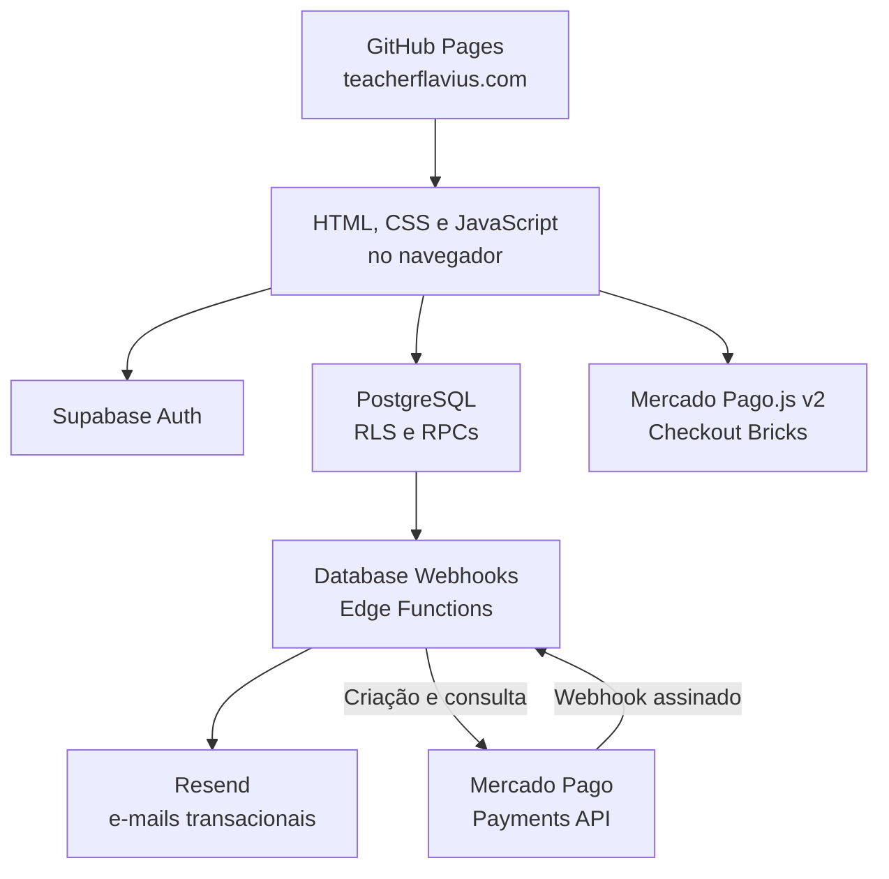

# Teacher Flávio — Portal de Ensino de Inglês

<!-- markdownlint-disable MD013 -->

Site oficial e portal acadêmico do Teacher Flávio, disponível em
[teacherflavius.com](https://teacherflavius.com).

O projeto deixou de ser apenas uma coleção de atividades estáticas. Atualmente,
ele reúne matrícula, autenticação, áreas do aluno e do professor, gestão de
turmas, registro de lições, frequência, exercícios, mensalidades, reposições,
aulas de gramática, pagamentos online, notificações por e-mail, rodapé
institucional compartilhado e acompanhamento de acessos.

## Visão geral

Há três experiências principais:

- **Visitante:** conhece as aulas, inicia uma matrícula e acessa o login.
- **Aluno autenticado:** consulta sua turma, materiais, frequência, roteiro,
  exercícios, reposições, aulas de gramática e perfil.
- **Professor administrador:** gerencia alunos, turmas, lições, exercícios,
  mensalidades, reposições e relatórios de acesso.

O frontend é estático e hospedado no GitHub Pages. Autenticação, dados, regras de
acesso e funções remotas ficam no Supabase. As notificações de matrícula e
reposição são enviadas pelo Resend por meio de Supabase Edge Functions.



## Tecnologias

| Camada | Tecnologia |
| --- | --- |
| Hospedagem | GitHub Pages com domínio personalizado |
| Frontend | HTML, CSS e JavaScript sem etapa de build |
| Cliente de dados | `@supabase/supabase-js` v2 carregado por CDN |
| Atividades antigas | React e ReactDOM carregados por CDN |
| Autenticação | Supabase Auth com e-mail e senha |
| Banco | PostgreSQL do Supabase |
| Autorização | Row Level Security (RLS) e RPCs PostgreSQL |
| Funções de servidor | Supabase Edge Functions em TypeScript/Deno |
| E-mail | Resend |
| Pagamentos | Mercado Pago Checkout Bricks e Payments API (`/v1/payments`) |

## Rotas principais

Os diretórios com `index.html` fornecem URLs amigáveis. Alguns arquivos `.html`
na raiz são mantidos por compatibilidade.

### Páginas públicas

| Rota | Finalidade |
| --- | --- |
| `/` | Página inicial com entrada para alunos e visitantes |
| `/quero_conhecer.html` | Apresentação das opções de estudo |
| `/matricula/` | Matrícula e criação da conta do aluno |
| `/login/` | Login com e-mail e senha |

### Área do aluno

| Rota | Finalidade |
| --- | --- |
| `/area-do-estudante/` | Menu principal do aluno |
| `/perfil/` | Dados pessoais e histórico de atividades |
| `/minha-turma/` | Turma, videoaula, material, gravações e grupo |
| `/reposicoes/` | Consulta, agendamento e cancelamento de reposições |
| `/pagamento/` | Pagamento de mensalidades com Pix ou cartão de crédito |
| `/frequencia/` | Histórico de lições e frequência |
| `/exercicios-diarios/` | Portal de exercícios publicados |
| `/roteiro-de-estudos/` | Roteiro e progresso das lições |
| `/aulas-de-gramatica.html` | Videoaulas e exercícios de gramática |
| `/guia-do-estudante.html` | Orientações para o aluno |

### Área do professor

| Rota | Finalidade |
| --- | --- |
| `/professor/` | Menu administrativo |
| `/perfil-dos-alunos/` | Lista, consulta e edição de alunos |
| `/acessos-dos-alunos/` | Data, hora e páginas acessadas pelos alunos |
| `/mensalidades/` | Configuração, geração e registro de pagamentos |
| `/turmas/` | Criação e gestão de turmas |
| `/reposicoes-admin/` | Publicação de horários e acompanhamento de reservas |
| `/quadro-de-turmas.html` | Visão geral de turmas, horários e tags |
| `/criar-exercicio/` | Cadastro de links de exercícios |
| `/aulas-de-gramatica-interface-do-professor.html` | Gestão das aulas de gramática |
| `/exercicios-dos-alunos/` | Progresso dos exercícios feitos pelos alunos |

### Atividades estáticas

O repositório ainda contém quizzes tradicionais e exercícios de ordenar frases,
como:

- `in_on_at.html`;
- `there_to_be.html`;
- `this_that_these_those.html`;
- `simple_present.html`;
- `simple_past.html`;
- `ordenar_simple_present.html`.

Essas atividades usam `quiz_core.js` e salvam resultados em
`activity_results` no Supabase. Como o gabarito faz parte do JavaScript entregue
ao navegador, elas são adequadas para prática pedagógica e revisão.

## Funcionalidades

### Autenticação e matrícula

- criação de conta com e-mail e senha;
- confirmação de e-mail e redirecionamento para o login;
- cadastro de nome, CPF, WhatsApp, chave PIX e disponibilidade;
- código de matrícula;
- pré-matrículas e posterior associação à conta;
- distinção entre aluno e professor administrador.

`auth.js` concentra sessão, login, matrícula, perfil e gravação de resultados.
`supabase_config.js` contém somente a URL do projeto e a chave pública usada pelo
navegador.

### Turmas e acompanhamento pedagógico

- uma turma ativa por aluno;
- criação, edição e ordenação de turmas;
- exibição alfabética nas telas administrativas;
- links de videoaula, material, aulas gravadas e grupo;
- registros de L1 a L74 e opções especiais;
- histórico de lições preservado quando o aluno muda de turma;
- controle de presença e histórico individual;
- tags administrativas, como `pacote antigo`.

### Exercícios

- exercícios cadastrados pelo professor;
- publicação imediata ou programada;
- marcação de conclusão pelo aluno;
- roteiro de estudos com progresso individual.

### Reposições

- cada horário publicado tem duração padrão de uma hora;
- o professor escolhe o horário inicial, a turma e a capacidade;
- o link da videoaula é copiado dos recursos da turma;
- alunos matriculados podem reservar vagas disponíveis;
- cancelamento pelo aluno antes do limite definido pelo banco;
- cancelamento administrativo;
- devolução automática da vaga;
- e-mails de confirmação e cancelamento;
- datas armazenadas em UTC e exibidas em `America/Sao_Paulo`.

Detalhes: [CONFIGURAR_REPOSICOES.md](CONFIGURAR_REPOSICOES.md).

### Mensalidades

- valor, vencimento, situação e observações por aluno;
- definição e identificação do valor individual diretamente em `/perfil-dos-alunos/`;
- geração das mensalidades do mês;
- registro e estorno de pagamento;
- pagamento pelo aluno com Pix ou cartão de crédito em `/pagamento/`;
- faixa global e pop-up para cobranças em aberto;
- confirmação automática por Webhook do Mercado Pago;
- histórico de eventos financeiros;
- administração restrita ao professor e consulta individual pelo aluno.

A integração atual usa **Checkout Bricks com a Payments API**, por meio do
endpoint `/v1/payments`. Ela não usa a Orders API. Ao criar a aplicação no
Mercado Pago, escolha Checkout Transparente/Checkout Bricks e a opção
**Payments API (Legacy)** para manter compatibilidade com o backend existente.

Configuração: [CONFIGURAR_MERCADO_PAGO.md](CONFIGURAR_MERCADO_PAGO.md).

### Acessos dos alunos

O rastreador registra:

- aluno autenticado;
- data e hora;
- caminho e título da página;
- fuso horário informado pelo navegador.

Não são registrados localização, coordenadas, endereço IP nem parâmetros da URL.
Os registros são restritos ao professor e mantidos por no máximo 90 dias.

### E-mails transacionais

As Edge Functions relacionadas a notificações e pagamentos incluem:

| Função | Origem | Finalidade |
| --- | --- | --- |
| `notify-new-enrollment` | Inserção em `enrollment_email_notifications` | Avisar o professor sobre uma nova matrícula |
| `notify-makeup-booking` | Inserção em `makeup_class_email_notifications` | Confirmar agendamento ou cancelamento de reposição |
| `create-mercado-pago-payment` | Aluno autenticado | Criar Pix ou pagamento por cartão com valor validado no banco |
| `mercado-pago-webhook` | Webhook assinado do Mercado Pago | Atualizar, confirmar ou reverter o pagamento da mensalidade |

As funções de e-mail são chamadas por Database Webhooks e exigem o cabeçalho
privado `x-webhook-secret`. A criação de pagamentos exige JWT do aluno e usa a
Payments API do Mercado Pago. O webhook do Mercado Pago não recebe JWT do
Supabase e valida a assinatura HMAC `x-signature` antes de consultar e aplicar
qualquer pagamento.

Detalhes: [CONFIGURAR_EMAIL_MATRICULAS.md](CONFIGURAR_EMAIL_MATRICULAS.md) e
[CONFIGURAR_REPOSICOES.md](CONFIGURAR_REPOSICOES.md).

## Estrutura do repositório

| Arquivo ou diretório | Responsabilidade |
| --- | --- |
| `index.html` | Entrada pública do site |
| `site_footer.js` | Rodapé institucional compartilhado entre todas as páginas |
| `student_payment_notice.js` | Faixa e pop-up globais de mensalidade pendente |
| `auth.js` | Autenticação, matrícula, perfil e resultados |
| `supabase_config.js` | URL e chave pública do Supabase |
| `professor.html` / `area_do_estudante.html` | Menus principais |
| `turmas.js` / `turma.js` / `minha_turma.js` | Gestão e visualização das turmas |
| `reposicoes_admin.js` / `reposicoes.js` | Agenda de reposições |
| `mensalidades.js` | Controle financeiro |
| `pagamento/` | Checkout do aluno com Mercado Pago Checkout Bricks |
| `perfil_dos_alunos.js` | Administração de alunos |
| `acessos_dos_alunos.js` | Relatório de acessos |
| `student_access_tracker.js` | Registro de páginas acessadas |
| `class_lesson_attendance.js` | Registro de lições e presença |
| `class_recorded_lessons.js` | Link de aulas gravadas |
| `quiz_core.js` | Motor dos quizzes estáticos |
| `supabase/functions/` | Edge Functions versionadas |
| `supabase_*.sql` | Estrutura, RPCs, políticas e correções do banco |
| `CONFIGURAR_*.md` | Instruções específicas dos módulos |
| `SUPABASE_SEGURANCA.md` | Segurança, aplicação e checklists |
| `CNAME` | Domínio personalizado do GitHub Pages |

## Executar localmente

Não há instalação de dependências nem processo de compilação para o frontend.
Sirva a raiz do repositório por HTTP:

```bash
python3 -m http.server 8000
```

Depois acesse <http://localhost:8000>.

Não abra as páginas com `file://`: o projeto usa rotas absolutas, autenticação e
requisições HTTP. Para testar cadastro ou confirmação de e-mail localmente,
adicione a URL local às URLs permitidas no Supabase Auth e ajuste
temporariamente o redirecionamento definido em `auth.js`. Não publique essa
alteração de desenvolvimento.

## Configurar o Supabase

### 1. Frontend

Edite `supabase_config.js`:

```javascript
window.SUPABASE_CONFIG = {
  url: "https://SEU_PROJECT_REF.supabase.co",
  anonKey: "SUA_CHAVE_PUBLICA"
};
```

A chave pública pode ser usada no navegador quando RLS e permissões estão
corretamente configuradas. Nunca coloque `service_role`, Secret Key, senha do
banco ou chave do Resend no frontend ou no repositório.

Configuração inicial: [SUPABASE_SETUP.md](SUPABASE_SETUP.md).

### 2. Banco de dados

Os arquivos SQL representam a evolução incremental do banco; ainda não são uma
cadeia formal de migrations executada automaticamente. Por isso:

- faça backup antes de mudanças estruturais;
- leia o cabeçalho de cada SQL e respeite as dependências;
- não execute todos os arquivos indiscriminadamente em produção;
- faça primeiro o merge do código e depois execute o SQL correspondente;
- aplique os scripts de segurança por último, pois scripts antigos podem
  recriar funções ou políticas anteriores.

Ordem de dependência para uma instalação nova:

1. Execute a estrutura inicial descrita em `SUPABASE_SETUP.md`.
2. Execute `supabase_add_profile_enrollment_columns.sql`.
3. Edite o e-mail do professor e execute `supabase_professor_admin.sql`.
4. Execute `supabase_pre_matriculas.sql` e `supabase_turmas.sql`.
5. Execute `supabase_pre_matriculas_turmas.sql`.
6. Instale os complementos de turma:
   - `supabase_aulas_gravadas.sql`;
   - `supabase_ordem_turmas.sql`;
   - `supabase_student_tags.sql`;
   - `supabase_limite_excepcional_quinta_21h.sql`.
7. Instale o registro de lições:
   - `supabase_licoes_turma.sql`;
   - `supabase_licoes_pre_matriculas_fix.sql`;
   - `supabase_licoes_opcoes_extras.sql`;
   - `supabase_preservar_licoes_troca_turma.sql`;
   - `supabase_frequencia_aluno.sql`.
8. Instale os módulos necessários:
   - `supabase_exercicios_diarios.sql`;
   - `supabase_roteiro_de_estudos.sql`;
   - `supabase_exercicios_professor.sql`;
   - `supabase_aulas_de_gramatica.sql`;
   - `supabase_reposicoes.sql`;
   - `supabase_mensalidades.sql`;
   - `supabase_acessos_alunos.sql`.
9. Para e-mail de matrícula, execute
   `supabase_notificacoes_matricula.sql`.
10. Execute por último:
    - `supabase_seguranca_fase1.sql`;
    - `supabase_seguranca_fase2_rls.sql`.

Os arquivos com `corrigir`, `fix` ou regras de migração existem para atualizar
instalações antigas. Use-os quando o cabeçalho descrever o estado do banco que
está sendo corrigido. Exemplos:

- `supabase_corrigir_funcoes_pre_matriculas_turmas.sql`: corrige erro `42P13`;
- `supabase_corrigir_troca_de_turma.sql`: corrige conflito de chave ao trocar a
  turma do aluno;
- `supabase_aluno_uma_turma.sql`: garante uma turma atual por aluno;
- `supabase_preservar_licoes_troca_turma.sql`: mantém o histórico pedagógico
  após a troca.

Ao aplicar um corretivo que recrie funções ou políticas, reaplique as fases de
segurança e execute os checklists.

### 3. Edge Functions e Resend

Secrets necessários:

```text
RESEND_API_KEY
ENROLLMENT_NOTIFICATION_EMAIL
ENROLLMENT_FROM_EMAIL
ENROLLMENT_WEBHOOK_SECRET
```

Configuração pelo CLI:

```bash
npx supabase login
npx supabase link --project-ref SEU_PROJECT_REF
npx supabase secrets set RESEND_API_KEY=re_sua_chave
npx supabase secrets set ENROLLMENT_NOTIFICATION_EMAIL=seu-email@exemplo.com
npx supabase secrets set 'ENROLLMENT_FROM_EMAIL=Matrículas <matriculas@seudominio.com>'
npx supabase secrets set ENROLLMENT_WEBHOOK_SECRET=UM_SEGREDO_LONGO_E_ALEATORIO
```

Publicação:

```bash
npx supabase functions deploy notify-new-enrollment --no-verify-jwt
npx supabase functions deploy notify-makeup-booking --no-verify-jwt
npx supabase functions deploy create-mercado-pago-payment
npx supabase functions deploy mercado-pago-webhook --no-verify-jwt
```

Mercado Pago exige os Secrets `MERCADO_PAGO_PUBLIC_KEY`,
`MERCADO_PAGO_ACCESS_TOKEN`, `MERCADO_PAGO_WEBHOOK_SECRET` e
`SITE_URL=https://teacherflavius.com`. Veja o procedimento completo em
[CONFIGURAR_MERCADO_PAGO.md](CONFIGURAR_MERCADO_PAGO.md).

`MERCADO_PAGO_PUBLIC_KEY` e `MERCADO_PAGO_ACCESS_TOKEN` devem pertencer à mesma
aplicação e ao mesmo ambiente. Para produção, ative as credenciais produtivas,
cadastre `https://teacherflavius.com` como site e mantenha uma chave Pix ativa
na conta vendedora. Não use credenciais de uma aplicação configurada somente
para Orders API com a função atual.

Database Webhooks:

| Nome | Tabela | Evento | URL |
| --- | --- | --- | --- |
| `notify-new-enrollment` | `public.enrollment_email_notifications` | `INSERT` | `/functions/v1/notify-new-enrollment` |
| `notify-makeup-booking` | `public.makeup_class_email_notifications` | `INSERT` | `/functions/v1/notify-makeup-booking` |

Inclua em ambos:

```text
Content-Type: application/json
x-webhook-secret: mesmo valor de ENROLLMENT_WEBHOOK_SECRET
```

### 4. Testar pagamentos

1. Defina um valor de mensalidade para um aluno de teste.
2. Entre na conta desse aluno e abra `/pagamento/`.
3. Escolha Pix e confirme que o Mercado Pago gera o QR Code e o código copia e
   cola.
4. Confira em `tuition_payment_attempts` se o registro recebeu
   `payment_method = pix`, um `provider_payment_id` e o status
   `pending_waiting_transfer`.
5. Para validar o fluxo completo, use uma mensalidade de valor reduzido, pague
   o Pix e confirme a transição para `approved`, o registro da data de pagamento
   e a remoção dos avisos de cobrança.

Com credenciais de produção, o QR Code é **real** (`live_mode = true`). Gerar o
Pix não movimenta dinheiro, mas pagá-lo realiza uma transferência verdadeira.
Não pague uma cobrança de teste com valor integral apenas para validar a criação
do código.

## Modelo de segurança

- Todas as tabelas expostas devem permanecer com RLS ativo.
- Alunos autenticados acessam somente registros permitidos pelas políticas.
- Operações administrativas passam por RPCs que verificam
  `is_teacher_admin()`.
- Funções `SECURITY DEFINER` têm execução explicitamente controlada.
- Tabelas com gabaritos, tentativas, logs e filas não são acessadas diretamente
  pelo navegador.
- `service_role` é exclusiva de rotinas de servidor.
- Edge Functions chamadas por webhooks exigem um segredo compartilhado.
- O repositório é público: nenhum segredo operacional pode ser versionado.

As fases atuais de hardening estão documentadas em
[SUPABASE_SEGURANCA.md](SUPABASE_SEGURANCA.md). Há também arquivos de rollback
emergencial para cada fase.

Ao criar tabelas novas, declare explicitamente os `GRANT`s necessários. RLS e
permissões de tabela são camadas diferentes, e projetos Supabase novos podem não
expor tabelas à Data API automaticamente.

## Dados pessoais e privacidade

O sistema pode armazenar nome, e-mail, CPF, WhatsApp, chave PIX, disponibilidade,
progresso pedagógico, pagamentos e histórico de acesso. Esses dados devem ser
tratados como confidenciais.

Recomendações operacionais:

- manter acesso administrativo individual;
- não compartilhar credenciais;
- revisar periodicamente administradores e políticas RLS;
- manter retenção mínima necessária;
- documentar finalidade e base legal do tratamento;
- excluir ou anonimizar dados quando não forem mais necessários;
- nunca inserir dados reais em issues, commits, logs públicos ou testes.

## Publicação

O site é publicado pelo GitHub Pages a partir da branch configurada no
repositório. O arquivo `CNAME` define:

```text
teacherflavius.com
```

Fluxo recomendado:

1. crie uma branch;
2. faça a alteração;
3. valide as páginas afetadas;
4. abra uma Pull Request;
5. faça o merge;
6. execute manualmente SQL e deploy de Edge Functions, quando necessários;
7. valide produção e o Database Advisor.

O merge publica apenas os arquivos do repositório. Ele não executa SQL, não
altera Secrets e não republica Edge Functions automaticamente.

Ao alterar arquivos JavaScript ou CSS, atualize o parâmetro `?v=` nas páginas que
os carregam para reduzir problemas de cache no navegador.

## Checklist de validação

### Público

- página inicial e navegação;
- matrícula;
- login e recuperação de sessão;
- layout em celular.

### Aluno

- perfil;
- turma e recursos;
- frequência e roteiro;
- conclusão de exercícios;
- agendamento e cancelamento de reposição;
- aviso de mensalidade, pagamento por Pix e cartão e confirmação automática;
- logout.

### Professor

- credencial administrativa;
- alunos e edição de perfil;
- criação e ordenação de turmas;
- troca de turma sem perda do histórico;
- lições e frequência;
- exercícios;
- mensalidades;
- reposições;
- relatório de acessos.

### Integrações

- filas de notificação;
- Database Webhooks;
- logs das Edge Functions;
- entrega no Resend;
- criação de pagamento e assinatura do Webhook do Mercado Pago;
- transição de Pix de `pending_waiting_transfer` para `approved` após pagamento;
- Security e Performance Advisors do Supabase.

Não existe atualmente uma suíte automatizada de testes. Mudanças devem passar
pelos testes manuais dos módulos afetados antes e depois da publicação.

## Solução de problemas

| Sintoma | Verificação |
| --- | --- |
| `permission denied for function ...` | Confirme se o SQL do módulo foi executado e reaplique `supabase_seguranca_fase1.sql` |
| Página retorna lista vazia após mudança de RLS | Confirme sessão, papel e políticas; consulte `SUPABASE_SEGURANCA.md` |
| Erro `42P13` em pré-matrículas/turmas | Execute `supabase_corrigir_funcoes_pre_matriculas_turmas.sql` e depois o SQL principal |
| Erro de chave duplicada ao trocar turma | Execute `supabase_corrigir_troca_de_turma.sql` |
| E-mail permanece `pending` | Verifique webhook, URL, segredo, deploy e logs da Edge Function |
| E-mail fica `failed` | Consulte `last_error` e os logs do Resend/Edge Function |
| Pagamento informa que o Mercado Pago não está configurado | Confirme os quatro Secrets descritos em `CONFIGURAR_MERCADO_PAGO.md` |
| Mercado Pago retorna `401 unauthorized` | Confirme que o Access Token é da aplicação correta, que Public Key e Access Token são do mesmo ambiente e que a aplicação foi criada para Payments API, não somente Orders API |
| Pix está em `pending_waiting_transfer` | O código foi criado corretamente e aguarda a transferência; não marque a mensalidade como paga antes do Webhook confirmar `approved` |
| Pagamento aprovado continua pendente | Confira o Webhook de produção, a assinatura secreta e os logs de `mercado-pago-webhook` |
| Reposição não aparece | Confirme data futura, vaga, turma ativa e link válido da videoaula |
| Alteração de JS/CSS não aparece | Atualize o `?v=` e limpe o cache |
| Rota amigável retorna 404 | Confirme o diretório com `index.html`, configuração do Pages e `CNAME` |

## Documentação complementar

- [Configuração inicial do Supabase](SUPABASE_SETUP.md)
- [Segurança do Supabase](SUPABASE_SEGURANCA.md)
- [Reposições](CONFIGURAR_REPOSICOES.md)
- [E-mail de matrícula](CONFIGURAR_EMAIL_MATRICULAS.md)
- [Pagamentos com Mercado Pago](CONFIGURAR_MERCADO_PAGO.md)

## Público-alvo

Alunos de inglês do Teacher Flávio e o professor responsável pela administração
pedagógica e financeira da escola.
